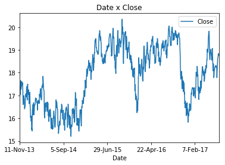
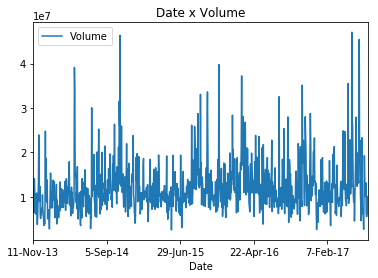
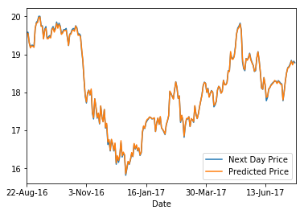

# Nanodegree Engenheiro de Machine Learning
## Projeto Final

Gabriel Givigier  
28 de julho de 2017

### 1. Definição

#### Visão Geral do Projeto
A negociação de ações na bolsa de valores é um dos tipos de investimentos mais rentáveis, e também um dos mais arriscados. Visando reduzir as incertezas e maximizar o lucro com esse tipo de investimento, empresas especializadas constroem modelos que tem o objetivo de prever o preço de ações nos próximos dias.

Construir um modelo desse tipo é uma tarefa complexa pois temos diversos fatores que influenciam o preço de uma ação. Dentre eles podemos citar: notícias relacionadas à empresa, balanço financeiro da empresa, economia do país em que atua, histórico de preços da ação, etc. Apesar de termos diversos fatores que influenciam no preço de uma ação, é relativamente fácil encontrarmos dados para tentarmos fazer essa predição.

Nesse projeto nós construiremos um script(capstone.ipynb, anexado ao projeto) em Python que utiliza os dados históricos de preço das ações da Ambev, obtidos através do Google Finance, para prevermos o preço dessa ação no dia seguinte aos dados que temos.

Nosso objetivo não é criar um preditor com um alto nível de certeza pois esse é um problema muito complexo até para grandes empresas. Nosso objetivo é tentar descobrir os parâmetros que nos permitem ter a melhor precisão de como prever os preços dessa ação.

#### Definição do Problema
Como foi citado anteriormente, nosso objetivo é criar um script que vai utilizar características como preço na abertura do mercado, preço no fechamento do mercado, preço mínimo, preço máximo e volume de transações, para prever o preço das ações da Ambev no próximo dia. As tarefas para criarmos esse projeto são:

1. Baixar os dados históricos, desde 2013 até 2017, da ação da Ambev(ABEV3) negociados na Bovespa(BVMF), através do [Google Finance](https://www.google.com/finance/historical?q=BVMF%3AABEV3&ei=61MsWYm1JYKgebzLs9AB).
2. Analisar o conjunto de dados da ação.
3. Testar diferentes características do problema com o intuito de buscar qual algoritmo e características apresentam melhor resultado.
4. Treinar um modelo com o algoritmo e características que obtiveram o melhor desempenho, e tentar prever qual será o preço da ação do dia seguinte.

#### Métricas
Para avaliarmos a precisão do nosso modelo, veremos o quanto o valor predito pelo modelo para o próximo dia difere do valor real da ação no momento do fechamento do mercado.

Além disso, a forma como verificaremos a diferença entre o valor real e o valor predito será utilizando métrica r-quadrado. A opção pela utilização dessa forma de avaliação do modelo se deu primeiramente pois essa é uma forma que se adequa perfeitamente ao nosso problema, que é um problema de regressão.

Também escolhi essa métrica devido ao fato de que ao elevarmos ao quadrado a diferença entre valor real e o predito, impedimos que valores positivos e negativos se anulem e assim tenhamos uma falsa sensação de precisão do modelo.

Por fim, nossa métrica será um valor entre 0 e 1, sendo 0 o pior resultado possível e 1 o melhor possível, o que significa que o nosso modelo se adequa bem ao problema.

### 2. Análise

#### Exploração dos Dados
Um dos conjuntos de dados utilizados nesse projeto consiste nos dados da ação da Ambev(ABEV3) negociados na Bovespa(BVMF), a principal bolsa de valores do Brasil. O intervalo de ações escolhido para análise foi de 11 de novembro de 2013 até 20 de julho de 2017 e as características da ação que utilizaremos serão: Date, Open, High, Low, Close. Essas características foram obtidas através do [Google Finance](https://www.google.com/finance/historical?q=BVMF%3AABEV3&ei=61MsWYm1JYKgebzLs9AB), que nos permite baixar em CSV de forma simples os dados históricos de diversas ações. Abaixo descrevo em detalhes qual o significado de cada característica, bem como o formato e o tipo de dado da característica.

1. **Date:** Dia em que os dados da ação foram coletados. Esse é um dado do tipo Data e possui o formato "Dia-Mês-Dois últimos dígitos do ano".
2. **Open:** Preço da ação no momento de abertura do mercado na data registrada. Esse é um dado do tipo Decimal, é registrado em Reais(R$) e tem o formato que representa os números após o ponto como centavos e antes do ponto como reais.
3. **High:** Preço máximo da ação na data registrada. Esse é um dado do tipo Decimal, é registrado em Reais(R$) e tem o formato que representa os números após o ponto como centavos e antes do ponto como reais.
4. **Low:** Preço mínimo da ação na data registrada. Esse é um dado do tipo Decimal, é registrado em Reais(R$) e tem o formato que representa os números após o ponto como centavos e antes do ponto como reais.
5. **Close:** Preço da ação no momento de fechamento do mercado na data registrada. Esse é um dado do tipo Decimal, é registrado em Reais(R$) e tem o formato que representa os números após o ponto como centavos e antes do ponto como reais.
6. **Volume:** Número de ações negociadas na data registrada.

Com os dados descritos, podemos ver alguns exemplos do nosso CSV:

| Date | Open | High | Low | Close | Volume |
|:-:|:-:|:-:|:-:|:-:|:-:|
| 23-05-17 | 18.57 | 18.98 | 18.57 | 18.89 | 16456700 |
| 24-05-17 | 19.08 | 19.14 | 18.84 | 18.86 | 10182300 |
| 25-05-17 | 18.96 | 19.04 | 18.77 | 18.92 | 8840600 |
| 26-05-17 | 19.00 | 19.08 | 18.83 | 19.03 | 11818800 |

Em relação às estatísticas básicas do nosso conjunto de dados, nós temos:

|| Open | High | Low | Close | Volume |
|:-:|:-:|:-:|:-:|:-:|:-:|:-:|
| **mean** | 17.84 | 18.03 | 17.64 | 17.85 | 12077422,26 |
| **std** | 1.28 | 1.27 | 1.28 | 1.28 | 5715852,62 |
| **min** | 15.02 | 15.48 | 14.95 | 15.20 | 2539800 |
| **25%** | 16.66 | 16.82 | 16,50 | 16.67 | 8554025 |
| **50%** | 18.06 | 18.23 | 17.85 | 18.06 | 10858200 |
| **75%** | 18.97 | 19.14 | 18.75 | 18.95 | 13956125 |
| **max** | 20.40 | 20.46 | 20.19 | 20.35 | 47040600 |

Com base nas estatísticas da tabela anterior, podemos ver que o preço de fechamento da ação, entre 2013 e 2017, ficou aproximadamente entre R$15,00 e R$20,00. Também podemos observar que o preço médio de fechamento da ação ficou em R$17,85 e que o desvio padrão do preço de fechamento ficou em aproximadamente 1.28, o que significa não temos uma dispersão muito grande dos preços diários e que eles ficam próximos da média. Outra informação importante que conseguimos extrair dos dados é que apesar do preço de fechamento da ação ficar entre R$15,00 e R$20,00, os quartis nos dizem que a maior parte dos dados fica entre R$16,67 e R$18,95.

Além dos dados da ação da Ambev, também utilizaremos os dados do Índice Bovespa(Ibov). Esse é um dos principais índices da Bovespa e tem como objetivo representar o desempenho médio das ações com maior representatividade do mercado brasileiro. O intervalo escolhido é o mesmo que utilizamos para os dados da Ambev, 11 de novembro de 2013 até 20 de julho de 2017, e a forma que capturamos esses dados também foi através do [Google Finance](https://www.google.com/finance/historical?q=INDEXBVMF%3AIBOV&ei=yhR1Wdm1KoeTed6SjOAJ).

Como características dos dados do Ibov, nós temos:

1. **Date:** Dia em que os dados do índice foram coletados. Esse é um dado do tipo Data e possui o formato "Dia-Mês-Dois últimos dígitos do ano".
2. **Open:** Quantidade de pontos do índice na abertura do mercado na data registrada.
3. **High:** Quantidade máxima de pontos do índice na data registrada.
4. **Low:** Quantidade mínima de pontos do índice na data registrada.
5. **Close:** Quantidade de pontos do índice no fechamento do mercado na data registrada.

Com os dados descritos, podemos ver alguns exemplos do nosso CSV:

| Date | Open | High | Low | Close |
|:-:|:-:|:-:|:-:|:-:|:-:|
| 23-05-17 | 61670.21 | 62774.63 | 61670.21 | 62662.48 |
| 24-05-17 | 62672.62 | 64015.79 | 62672.62 | 63257.36 |
| 25-05-17 | 63256.47 | 63991.40 | 62761.80 | 63226.79 |
| 26-05-17 | 63227.51 | 64170.25 | 63227.51 | 64085.41 |

Em relação às estatísticas básicas do conjunto de dados do Ibov, nós temos:

|| Open | High | Low | Close |
|:-:|:-:|:-:|:-:|:-:|:-:|
| **mean** | 53770.61 | 54313.90 | 53248.74 | 53783.58 |
| **std** | 6603.44 | 6606.11 | 6600.23 | 6613.26 |
| **min** | 37500.79 | 38031.22 | 37046.07 | 37497.48 |
| **25%** | 49082.84 | 49688.85 | 48499.53 | 49081.74 |
| **50%** | 52813.55 | 53329.19 | 52282.78 | 52837.21 |
| **75%** | 58351.47 | 58885.58 | 57913.33 | 58368.91 |
| **max** | 69052.09 | 69487.58 | 68536.46 | 69052.03 |

Podemos ver que, no intervalo que analisamos, o Ibov ficou aproximadamente entre 37500 pontos e 69000 pontos. Sendo que em sua maioria, o índice ficou aproximadamente entre 49000 pontos e 58400 pontos.

#### Visualização Exploratória

Um fator interessante de analisarmos visualmente é a relação entre Volume e Preço de Fechamento. Segundo [analistas técnicos](http://br.advfn.com/educacional/analise-tecnica/volume), há uma forte relação entre a tendência de aumento de preços e o aumento do volume de negociação, alguns inclusive só confiam em uma tendência de aumento de preços se a mesma vier acompanhar de aumento também no volume de negociações. Nessa seção nosso objetivo será analisar visualmente os gráficos de Volume em relação tempo e Preço de Fechamento em relação ao tempo.

  

  

Ao plotarmos os gráficos, não conseguimos obter claramente tantos pontos que confirmem essa relação entre tendência de alta de preço e aumento do volume. Entretanto, há sim alguns pontos que apresentam essa relação. Podemos apontar por exemplo, o intervalo após 07/02/2017. Percebemos um aumento no volume de negociações e também um aumento nos preços da ação.

#### Algoritmos e Técnicas

O algoritmo escolhido foi o LinearRegression. O primeiro passo para definir porque esse algoritmo seria utilizado, foi o tipo do problema. O problema que estamos resolvendo é um problema de regressão, e para o solucionarmos, precisamos escolher um algoritmo especificamente para esse tipo de problema. O objetivo do LinearRegression é encontrar uma equação que melhor se adapte aos dados, ou seja, encontrar uma equação que minimize o erro. Como características desse algoritmo podemos citar: fácil de interpretar, não requer muito ajuste dos parâmetros e é rápido.

Conforme dito anteriormente, o [LinearRegression](http://scikit-learn.org/stable/modules/generated/sklearn.linear_model.LinearRegression.html#examples-using-sklearn-linear-model-linearregression) é um algoritmo que não requer muitos ajustes nos parâmetros. Podemos observar isso através da documentação do Scikit Learn. Esse algoritmo possui 4 parâmetros(fit_intercept, normalize, copy_X, n_jobs) e todos são opcionais, abaixo descreveremos o propósito de cada parâmetro:

- **fit_intercept**: Tem como valor padrão True e se definido como False, nenhuma intercepção será usada nos cálculos.
- **normalize**: Tem como valor padrão False e se definido como True, normaliza os dados de treinamento antes da regressão.
- **copy_X**: Tem como valor padrão True e indica se os dados de treinamento devem ser copiados, caso essa opção seja definida como False, os dados de treinamento podem ser sobreescritos.
- **n_jobs**: Tem como valor padrão 1 e define quantos jobs serão utilizados para computar o problema. Pode ser útil em problemas mais complexos pois permite otimizar o uso da CPU.

Além de definir qual algoritmo utilizaremos, também precisamos definir qual técnica utilizaremos para separar nossos dados em dados de treinamento e teste. Ao definirmos essa técnica, precisamos levar em consideração que os dados de ações da bolsa de valores possuem uma característica que nos impede de usar qualquer técnica de validação cruzada. Esses dados são dependentes de ordem. Por exemplo, os dados do dia 16-06-17 vem após os dados do dia 15-06-17, e essa ordem deve ser preservada. Não podemos alterar a ordem desses dados, uma técnica muito comum em aprendizado de máquina. Em caso de alteração da ordem dessa série temporal, podemos adicionar de forma indesejada, um viés em nossa análise.

Portanto, a técnica de separação dos dados em treinamento e teste levará em consideração os pontos observados acima e não alterará a ordem dos dados. Utilizaremos uma variação do KFold que também está presente no Scikit Learn, a [TimeSeriesSplit](http://scikit-learn.org/stable/modules/generated/sklearn.model_selection.TimeSeriesSplit.html), que possui um único parâmetro, a quantidade de divisões a serem feitas.

#### Dados de Referência

Nesse projeto, tentaremos construir um modelo que tenha uma precisão de ao menos 70%. Portanto, ao avaliarmos o modelo usando a métrica r-quadrado, teremos 0.7 ou mais de nota.

### 3. Metodologia

#### Pré-Processamento dos Dados

O primeiro processamento após o carregamento dos dados foi a reordenação. Nessa etapa, nós reordenamos os dados de forma que os dados mais antigos ficassem nos menores índices do DataFrame.

Após a reordenação, demos início à etapa de adicionar novas características ao conjunto de dados da ação da Ambev. Inicialmente adicionamos a característica 'Next Price', que é o preço da ação no dia seguinte no momento do fechamento do mercado. Por exemplo, o 'Next Price' para o dia 21 de julho será o preço da ação no momento do fechamento do mercado no dia 22 de julho. Essa característica é a que tentaremos prever, ou seja, será o nosso alvo.

Também achei interessante adicionar a característica 'Change', que representa a porcentagem de variação do preço da ação em relação ao dia anterior.

Após adicionarmos essas duas características, adicionamos alguns dados presentes no conjunto de dados do Ibov no conjunto de dados da Ambev. Adicionamos as características, 'Ibov Close', 'Ibov High' e 'Ibov Low' que são equivalentes às características 'Close', 'High' e 'Low' que apresentamos no conjunto de dados do Ibov. As características do Ibov foram adicionadas pois eu considero importante adicionarmos características que não sejam relacionadas apenas com a ação, mas com o mercado em geral, e o Ibov nos permite ter essa visão mais global.

Por fim, adicionamos a característica 'Day of Week', pois considerei a hipótese de que poderia haver uma relação de dias com maiores investimentos e o dia da semana.

Como exemplo dos dados após a adição das características, temos:

| Date | Open | High | Low | Close | Volume | Next Day Price | Change | Ibov Close | Ibov High | Ibov Low | Day of Week |
|:-:|:-:|:-:|:-:|:-:|:-:|:-:|:-:|:-:|:-:|:-:|:-:|
| 23-05-17 | 18.57 | 18.98 | 18.57 | 18.89 | 16456700 | 18.86 | 1.72 | 62662.48 | 62774.63 | 61670.21 | 1.00 |
| 24-05-17 | 19.08 | 19.14 | 18.84 | 18.86 | 10182300 | 18.92 | -0.16 | 63257.36 | 64015.79 | 62672.62 | 2.00 |
| 25-05-17 | 18.96 | 19.04 | 18.77 | 18.92 | 8840600 | 19.03 | 0.32 | 63226.79 | 63991.40 | 62761.80 | 3.00 |
| 26-05-17 | 19.00 | 19.08 | 18.83 | 19.03 | 11818800 | 18.88 | 0.58 | 64085.41 | 64170.25 | 63227.51 | 4.00 |

Vale esclarecer que para a coluna 'Day of Week', os valores 0, 1, 2, 3 e 4, representam respectivamente segunda-feira, terça-feira, quarta-feira, quinta-feira e sexta-feira.

Após a adição das novas características, verifiquei os dados em busca de valores nulos e possíveis erros. Um erro que procurei foi o preço da ação sendo 0.00, o que indicaria que a ação não existe. A primeira e última linhas precisaram ser removidas devido a valores nulos. Isso aconteceu por termos adicionado as características 'Change' e 'Next Day Price'. Ao adicionarmos a característica 'Change', adicionamos um valor nulo na primeira linha nessa coluna, pois não tínhamos o preço da ação no dia anterior e não tínhamos como calcular essa variação de preço. Também adicionamos um valor nulo na última linha, na coluna 'Next Day Price', pois não tínhamos o preço da ação no dia seguinte.

Também analisei os dados quanto a presença de outliers. A única característica que possuía outliers foi o Volume. Em todas as outras características não tivemos outliers. Portanto, decidi deixar todos os dados e não remover os outliers pois eram somente da característica Volume.

Além disso, após o carregamento dos dados, arredondamos todos os valores para utilizarem até 4 casas decimais e esse arredondamento é feito utilizando a função round do Pandas.

#### Implementação

Na primeira parte da implementação do projeto, foi realizado o carregamento dos dados utilizando a função read_csv do Pandas, com a qual carregamos os dados do arquivo *abev3.csv* e *ibov.csv* em DataFrame.

Após o carregamento dos dados, houve a divisão desses dados em características e o nosso alvo. Como características, foram selecionados os dados de Volume e Close, e como alvo nós temos os dados de Next Day Price, que é de fato o que queremos prever.

Também foi feita a divisão desses dados em 10 partes de dados de treinamento e dados de teste, utilizando o TimeSeriesSplit. Esse algoritmo foi utilizado e assim mantivemos a ordem dos dados, conforme explicado na seção Algoritmos e Técnicas. Após a divisão, tínhamos as variáveis X_train e X_test, que continham os dados de treinamento e teste das características. Também tínhamos y_train e y_test, que continham os dados de treinamento e teste do nosso alvo.

Com os dados divididos em treinamento e testes, os dados de treinamento foram utilizados para treinar o modelo utilizando o algoritmo LinearRegression. Para isso, utilizamos o objeto clf, que havia sido instanciado anteriormente, e chamamos o método fit com X_train e y_train como parâmetros. Após o treinamento do modelo, os dados de teste foram utilizados com o intuito de prever os preços. Para isso, utilizamos o método score, que internamente faz uma predição utilizando os dados de teste no modelo treinado, e além disso, aplica a métrica r-quadrado para verificar qual a precisão do modelo.

Após treinar o modelo, é preciso verificar a sua precisão. Como temos um array com 10 notas de avaliação do modelo, devido ao fato de termos dividido nossos dados em 10 partes de treinamento e teste, precisamos calcular a média dessas notas para então termos a precisão do modelo. Após calcularmos a média das 10 notas, concluímos que a nota do nosso modelo foi de 0.76.

Além do LinearRegression, também testei o algoritmo SVR. Porém, esse algoritmo apresentou notas negativas em todas as iterações, o que representa uma performance muito ruim. Portanto, resolvi não utilizá-lo mais nesse problema.

#### Refinamento

Com a nota da primeira implementação como base, testei outras combinações de parâmetros com o intuito de obter uma performance melhor do que a inicial. Entretanto, em todas as combinações testadas, a nota foi menor do que a implementação inicial. A única combinação que obteve desempenho próximo da nota inicial foi 'Volume', 'Close' e 'Change'.

Após esses testes, utilizei o GridSearchCV para fazer a otimização dos parâmetros. Como parâmetros a serem otimizados, foram utilizados o 'fit_intercept' e 'normalize'. E apesar dessa tentativa, a nota foi 0.765, muito próxima à melhor nota dos modelos não otimizados.

### 4. Resultados

#### Avaliação do Modelo e Validação

Escolhemos como o modelo 'vencedor' para esse problema, o modelo que utiliza como características 'Volume' e 'Close' e tem como alvo 'Next Day Price'. Esse modelo utiliza o algoritmo LinearRegression e obteve um desempenho de 0.76 utilizando a métrica r-quadrado.

Essa nota de 0.76 é o resultado da média das notas para cada iteração da nossa validação cruzada. As notas para cada uma das partições são apresentadas abaixo:

|| Nota |
|:-:|:-:|
| Parte 1 | 0.81291561425612358 |
| Parte 2 | 0.48792854143088044 |
| Parte 3 | 0.92834237714820056 |
| Parte 4 | 0.71730905444092019 |
| Parte 5 | 0.6029155403830917 |
| Parte 6 | 0.82135172426285108 |
| Parte 7 | 0.67692980346945764 |
| Parte 8 | 0.91703976970034928 |
| Parte 9 | 0.79901912440184875 |
| Parte 10 | 0.83643061811437747 |

Apesar de termos tentado melhorar o modelo adicionando novas features, não obtivemos sucesso. E além disso, a adição de algumas características, nos fez obter notas piores do que modelos com menos características.

Devido a nota 0.76 e a variação das notas de cada iteração, não podemos dizer que esse modelo é robusto o suficiente para tentar prever o preço da ação no dia seguinte. O mercado de ações é muito complexo e um modelo com apenas 0.76 de nota não é robusto o suficiente, pois certamente ocasionaria em muitas perdas caso tentássemos utilizá-lo.

#### Justificação

Apesar de o modelo construído não ser robusto o suficiente para utilizarmos em uma aplicação real no mercado de ações, atingimos o objetivo de obtermos uma nota maior do que 0.7. Além disso, esse modelo, apesar de não recomendado para uso profissional, pode servir como um bom indicativo de qual é a tendência de preço para o dia seguinte.

### 5. Conclusão

#### Visualização de Forma Livre

O gráfico abaixo é uma representação dos preços que o modelo construído previu e os preços reais para um determinado conjunto de testes, do dia 22 de agosto de 2016 até 20 de julho de 2017.

O objetivo desse gráfico é avaliar a diferença entre o valor real e o valor predito pelo modelo.

  

#### Reflexão

Nesse projeto eu criei um modelo para prever o preço da ação da Ambev no dia seguinte. Ao final do projeto obtivemos um modelo que teve como nota aproximadamente 0.76, em uma escala de 0 a 1.

Como etapas da criação desse modelo, nós tivemos primeiramente a escolha da fonte de onde coletaríamos os dados da ação. Obtemos os dados através do Google Finance por conseguirmos obter de forma fácil e confiável os dados que queríamos. Com os dados em mãos, os carregamos em memória utilizando o Pandas para ler os dados a partir do CSV que havíamos obtido no Google Finance.

Após o carregamento dos dados, fizemos algumas análises sobre o conjunto de dados para entendermos melhor algumas características. Por exemplo, analisamos qual era a variância dos nossos dados. Com uma visão melhor sobre nossos dados, iniciamos o pré-processamento. Nessa etapa nós adicionamos qual seria o alvo, o que tentaríamos prever, que era o preço da ação no dia seguinte. Também adicionamos algumas características que poderiam ser interessantes, como por exemplo dados do Índice Bovespa, variação do preço da ação e dia da semana que a ação foi negociada.

A próxima etapa do projeto foi a implementação do modelo. Inicialmente dividimos o conjunto de dados em treinamento e teste, respeitando a ordem dos dados. O primeiro algoritmo a ser testado foi o LinearRegression, e na primeira iteração, obtivemos um desempenho de 0.76. Após esse teste, utilizei o SVR, porém o resultado péssimo. Também testei o LinearRegression com algumas combinações de características diferentes das que eu havia testado na primeira iteração. Entretanto, não obtivemos notas muito melhores.

Finalizar esse projeto foi bem mais complicado do que eu imaginava, especialmente porque nesse projeto os alunos não recebem um guia de quais técnicas ou algoritmos utilizar, como recebíamos nos projetos anteriores. Entretanto, o projeto foi bem importante para que eu tivesse uma visão mais geral de como é trabalhar com um problema real.

Trabalhar nesse domínio de ações também foi muito desafiador. É uma área bem complexa, e que pequenos erros podem custar alguns milhares, ou até milhões, de reais. Além disso, há muitas variáveis que influenciam o preço de uma ação, o que torna difícil a tarefa de prever o preço futuro desses ativos. Dito isso, esse projeto serviu muito bem para estudo, porém não é recomendado seu uso em uma operação real de negociação de ações.

#### Melhoria

Como melhorias para esse projeto, poderíamos tentar encontrar novas características mais específicas que afetem o preço dessa ação. Um exemplo seria encontrar características específicas para o ramo de atuação da Ambev.

Outra tentativa, se possível, seria obter mais dados dessa ação. Os dados que utilizamos tem periodicidade diária. Caso obtivéssemos os dados da ação a cada 30 minutos por exemplo, teríamos um volume maior de dados para analisar, e talvez obtivéssemos uma precisão melhor.

Por último, eu tentaria utilizar outros algoritmos e comparar a performance com o LinearRegression.
