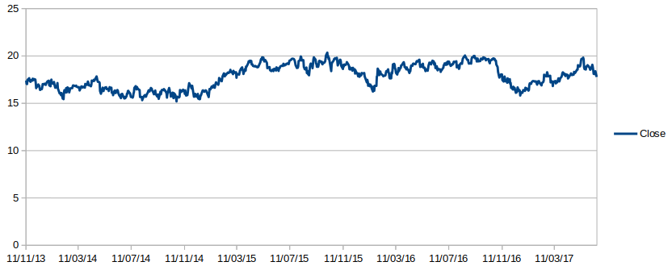
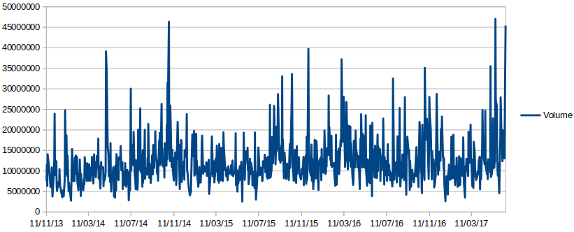

# Nanodegree Engenheiro de Machine Learning
## Projeto Final

Gabriel Givigier  
31 de Maio de 2017

### 1. Definição

#### Visão Geral do Projeto
A negociação de ações na bolsa de valores é um dos tipos de investimentos mais rentáveis, e também um dos mais arriscados. Visando reduzir as incertezas e maximizar o lucro com esse tipo de investimento, empresas especializadas constroem modelos que tem o objetivo de prever o preço de ações nos próximos dias.

Construir um modelo desse tipo é uma tarefa complexa pois temos diversos fatores que influenciam o preço de uma ação. Dentre eles podemos citar: notícias relacionadas à empresa, balanço financeiro da empresa, economia do país em que atua, histórico de preços da ação, etc. Apesar de termos diversos fatores que influenciam no preço de uma ação, é relativamente fácil encontrarmos dados para tentarmos fazer essa predição.

Nesse projeto nós construiremos um script em Python que utiliza os dados históricos de preço das ações da Ambev, obtidos através do Google Finance, para prevermos o preço dessa ação para os próximos três dias.

Nosso objetivo não é criar um preditor com um alto nível de certeza pois esse é um problema muito complexo até para grandes empresas. Nosso objetivo é tentar descobrir os parâmetros que nos permitem ter a melhor precisão de como prever os preços dessa ação.

#### Definição do Problema
Como foi citado anteriormente, nosso objetivo é criar um script que vai utilizar características como preço na abertura do mercado, preço no fechamento do mercado, preço mínimo, preço máximo e volume de transações, para prever o preço das ações da Ambev nos próximos três dias. As tarefas para criarmos esse projeto são:

1. Baixar os dados históricos, desde 2013 até 2017, da ação da Ambev(ABEV3) negociados na Bovespa(BVMF), através do [Google Finance](https://www.google.com/finance/historical?q=BVMF%3AABEV3&ei=61MsWYm1JYKgebzLs9AB).
2. Analisar o conjunto de dados da ação.
3. Testar diferentes algoritmos e características do problema com o intuito de buscar qual algoritmo e características apresentam melhor resultado.
4. Treinar um modelo com o algoritmo e características que obtiveram o melhor desempenho, e tentar obter uma correlação entre os dados históricos da ação e o valor futuro da mesma.

#### Métricas
Para avaliarmos a precisão do nosso modelo, veremos o quanto o valor predito pelo modelo difere do valor real da ação no momento do fechamento do mercado.

Além disso, a forma como verificaremos a diferença entre o valor real e o valor predito será utilizando métrica r-quadrado. A opção pela utilização dessa forma de avaliação do modelo se deu primeiramente pois essa é uma forma que se adequa perfeitamente ao nosso problema, que é um problema de regressão.

Também escolhi essa métrica devido ao fato de que ao elevarmos ao quadrado a diferença entre valor real e o predito, impedimos que valores positivos e negativos se anulem e assim tenhamos uma falsa sensação de precisão do modelo.

Por fim, nossa métrica será um valor entre 0 e 1, sendo 0 o pior resultado possível e 1 o melhor possível, o que significa que o nosso modelo se adequa bem ao problema.

### 2. Análise

#### Exploração dos Dados
O conjunto de dados utilizados nesse projeto consiste nos dados da ação da Ambev(ABEV3) negociados na Bovespa(BVMF), a principal bolsa de valores do Brasil. O intervalo de ações escolhido para análise foi de 11 de novembro de 2013 até 16 de junho de 2017 e as características da ação que utilizaremos serão: Date, Open, High, Low, Close. Essas características foram obtidas através do [Google Finance](https://www.google.com/finance/historical?q=BVMF%3AABEV3&ei=61MsWYm1JYKgebzLs9AB), que nos permite baixar em CSV de forma simples os dados históricos de diversas ações. Abaixo descrevo em detalhes qual o significado de cada característica, bem como o formato e o tipo de dado da característica.

1. **Date:** Dia em que os dados da ação foram coletados. Esse é um dado do tipo Data e possui o formato "Dia-Mês-Dois últimos dígitos do ano".
2. **Open:** Preço da ação no momento de abertura do mercado na data registrada. Esse é um dado do tipo Decimal, é registrado em Reais(R$) e tem o formato que representa os números após o ponto como centavos e antes do ponto como reais.
3. **High:** Preço máximo da ação na data registrada. Esse é um dado do tipo Decimal, é registrado em Reais(R$) e tem o formato que representa os números após o ponto como centavos e antes do ponto como reais.
4. **Low:** Preço mínimo da ação na data registrada. Esse é um dado do tipo Decimal, é registrado em Reais(R$) e tem o formato que representa os números após o ponto como centavos e antes do ponto como reais.
5. **Close:** Preço da ação no momento de fechamento do mercado na data registrada. Esse é um dado do tipo Decimal, é registrado em Reais(R$) e tem o formato que representa os números após o ponto como centavos e antes do ponto como reais.
6. **Volume:** Número de ações negociadas na data registrada.

Com os dados descritos, podemos ver alguns exemplos do nosso CSV:

| Date | Open | High | Low | Close | Volume |
|:-:|:-:|:-:|:-:|:-:|:-:|
| 23-05-17 | 18.57 | 18.98 | 18.57 | 18.89 | 16456700 |
| 24-05-17 | 19.08 | 19.14 | 18.84 | 18.86 | 10182300 |
| 25-05-17 | 18.96 | 19.04 | 18.77 | 18.92 | 8840600 |
| 26-05-17 | 19.00 | 19.08 | 18.83 | 19.03 | 11818800 |

Em relação as estatísticas básicas do nosso conjunto de dados, nós temos:

|| Open | High | Low | Close | Volume |
|:-:|:-:|:-:|:-:|:-:|:-:|:-:|
| **mean** | 17,8239189189189 | 18,0139527027027 | 17,6293468468469 | 17,8318581081081 | 12126211,9369369 |
| **std** | 1,29334789348276 | 1,28488025842176 | 1,29778521819744 | 1,29491853727385 | 5713186,22994283 |
| **min** | 15,02 | 15,48 | 14,95 | 15,2 | 2539800 |
| **25%** | 16,64 | 16,8 | 16,46 | 16,64 | 8672325 |
| **50%** | 18 | 18,18 | 17,815 | 18 | 10896300 |
| **75%** | 18,99 | 19,1725 | 18,7825 | 18,9825 | 14009450 |
| **max** | 20,4 | 20,46 | 20,19 | 20,35 | 47040600 |

Com base nas estatísticas da tabela anterior, podemos ver que o preço de fechamento da ação, entre 2013 e 2017, ficou aproximadamente entre R$15,00 e R$20,00. Também podemos observar que o preço médio de fechamento da ação ficou em R$17,83 e que o desvio padrão do preço de fechamento ficou em aproximadamente 1,29, o que significa não temos uma dispersão muito grande dos preços diários e que eles ficam próximos da média. Outra informação importante que conseguimos extrair dos dados é que apesar do preço de fechamento da ação ficar entre R$15,00 e R$20,00, os quartis nos dizem que a maior parte dos dados fica entre R$16,64 e R$18,98.

#### Visualização Exploratória

Um fator interessante de analisarmos visualmente é a relação entre Volume e Preço de Fechmanto. Segundo [analistas técnicos](http://br.advfn.com/educacional/analise-tecnica/volume), há uma forte relação entre a tendência de aumento de preços e o aumento do volume de negociação, alguns inclusive só confiam em uma tendência de aumento de preços se a mesma vier acompanhar de aumento também no volume de negociações. Nessa seção nosso objetivo será analisar visualmente os gráficos de Volume em relação tempo e Preço de Fechamento em relação ao tempo.

  **Gráfico Preço de fechamento x Data de negociação**
  

  **Gráfico Volume x Data de negociação**
  

Ao plotarmos os gráficos, não conseguimos obter claramente tantos pontos que confirmem essa relação entre tendência de alta de preço e aumento do volume. Entretanto, há sim alguns pontos que apresentam essa relação. Podemos apontar por exemplo, o intervalo após 11/03/2017. Percebemos um aumento no volume de negociações e também um aumento nos preços da ação.

#### Algoritmos e Técnicas

O algoritmo escolhido foi o LinearRegression. O primeiro passo para definir porque esse algoritmo seria utilizado foi o tipo do problema. O problema que estamos resolvendo é um problema de regressão, e para o solucionarmos, precisamos escolher um algoritmo especificamente para esse tipo de problema. O objetivo do LinearRegression é encontrar uma equação que melhor se adapte aos dados, ou seja, encontrar uma equação que minimize o erro. Como características desse algoritmo podemos citar: fácil de interpretar, não requer muito ajuste dos parâmetros e é rápido.

Conforme dito, o LinearRegression é um algoritmo que não requer muito ajuste dos parâmetros. Podemos observar isso através da documentação do Scikit

#### Dados de Referência
